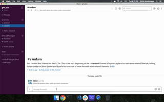

# op-slack-connector
This proof-of-concept (middleware) provides a connector for [Slack](https://api.slack.com/) and [Open Project](https://docs.openproject.org/api/) implementation integration.

## Currently supported feature:
- Log time using a Slack bot for a work-package in Open Project.

# Prerequisites
- IDE - VS Code
- OpenProject 8
- Slack app
- ngrok
- node
- git
- docker

# Setup and contribution guidelines
1. Fork and `git clone` the repo using HTTPS
2. Install [VS Code](https://code.visualstudio.com/Download) (I used this one) and open the cloned directory
3. Create a `.env` file in the home directory of project with `OP_ACCESS_TOKEN_2` and `BOT_ACCESS_TOKEN`. These will be assigned to tokens obtained from Open Project and Slack after installation
4. Install [Node](https://nodejs.org/en/download/) and do the following -  
   - In the project root directory do `npm init` to generate a package.json file or update the existing one
   - Also, run `npm install` to download and install the node modules from npm 
5. Install [Open project setup using docker](https://www.openproject.org/docker/) and launch it on a port
6. Install [ngrok](https://ngrok.com/download) and run it (`ngrok http 3000`) to get a public IP address
7. Using the above IP address create a Slack app and bot in [Slack](https://api.slack.com) and install it to the workspace
8. Run the op-slack-connector code in VS code `Ctrl + F5`
9. Follow the demo below to test the working
10. Make any code changes and raise a pull request
11. To see the flowchart: Open the [LogTimeFlow.xml](LogTimeFlow.xml) file in [Draw.io](http://draw.io)

# Setup using Docker
`docker pull girish17/op-slack-connector:latest`

# Demo

# Learning resources
- [Creating a Slack Command Bot from Scratch with Node.js & Distribute It](https://tutorials.botsfloor.com/creating-a-slack-command-bot-from-scratch-with-node-js-distribute-it-25cf81f51040)
